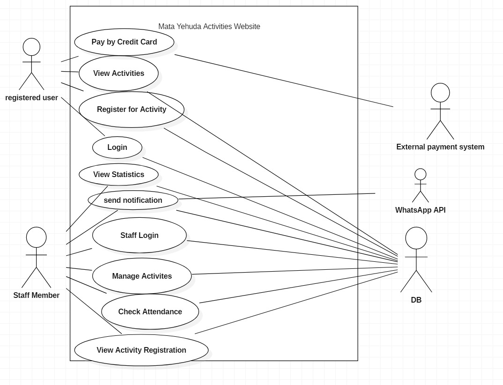

## System Actors

1. **Visitor / Participant** – A user who browses activities and registers for events without creating an account.

2. **Admin (Staff Member)** – A staff member of the association who manages activities and registrations.

3. **External Payment System** – A third-party payment service that processes online payments for paid activities.

4. **DB** - External Data Storage Service

5. **WhatsApp API** – External messaging service for sending confirmations / reminders / updates.

## Use-Case UML

The system includes the following main use cases:

Participant (Visitor):
- View Activities / View Monthly Calendar
- View Activity Details
- Register for Activity
- Pay by Credit Card (for paid activities)

Admin (Staff Member):
- Manage Activities
- View and Manage Registrations
- Check Attendance
- View Statistics
- Send Notification (via WhatsApp)

  

## UC1 – View Monthly Calendar

**Primary Actor:** Visitor  
**Preconditions:** The website is available.  
**Postconditions:** The monthly calendar is displayed.

### Basic Flow:
1. The user opens the Calendar page.
2. The system displays the current month with marked activities.
3. The user may navigate to another month.

### Exception Flows:
- If there are no activities in the selected month, the system displays a "No activities available" message.

## UC2 – Pay by Credit Card

**Primary Actor:** Visitor  
**Supporting Actor:** External Payment System  
**Preconditions:** A pending registration exists.  
**Postconditions:** Payment status is updated.

### Basic Flow:
1. The system redirects the user to the external payment service.
2. The user enters credit card details.
3. The payment service processes the transaction.
4. The payment result is returned to the system.
5. The system updates the registration status accordingly.

### Exception Flows:
- If payment fails, the system displays an error message.
- If the payment service is unavailable, the system asks the user to try again later.

## UC3 – Manage Activities

**Primary Actor:** Admin  
**Preconditions:** The admin is authorized.  
**Postconditions:** Activities are updated in the system.

### Basic Flow:
1. The admin opens the management panel.
2. The admin creates, edits, or deletes an activity.
3. The system validates the data.
4. The system saves changes and updates the calendar.

### Exception Flows:
- If invalid data is entered, the system displays an error message.

## UC4 – View and Manage Registrations (View Activity Registration)
**Primary Actor:** Admin (Staff Member)
**Supporting Actors:** DB
**Preconditions:** Admin is authorized (logged in). Activities exist.
**Postconditions:** Registration list is displayed and changes (if any) are saved.

### Basic Flow:
1. Admin opens the management panel.
2. Admin selects an activity.
3. The system displays all registrations for that activity (name, phone, status, payment/attendance flags).
4. Admin filters/sorts registrations (optional).
5. Admin updates a registration status (e.g., cancel / mark as paid / move to waitlist).
6. The system validates the change.
7. The system saves the update in the DB and shows a success message.
   
### Exception Flows:
- If the activity does not exist anymore → system shows an error message.
- If DB is unavailable → system shows “Try again later” and no changes are saved.
- If admin is not authorized → access denied.

## UC5 – Check Attendance
**Primary Actor:** Admin (Staff Member)
**Supporting Actors:** DB
**Preconditions:** Admin is authorized. The activity exists and has registrations.
**Postconditions:** Attendance is updated for selected participants.

### Basic Flow:
1. Admin selects an activity from the management panel.
2. The system displays the list of registered participants.
3. Admin marks participants as “Present/Absent”.
4. The system saves attendance results in the DB.
5. The system shows updated attendance summary.
   
### Exception Flows:
- If no registrations exist → system displays “No participants registered”.
- If saving fails → system shows an error and keeps previous attendance state.
  

